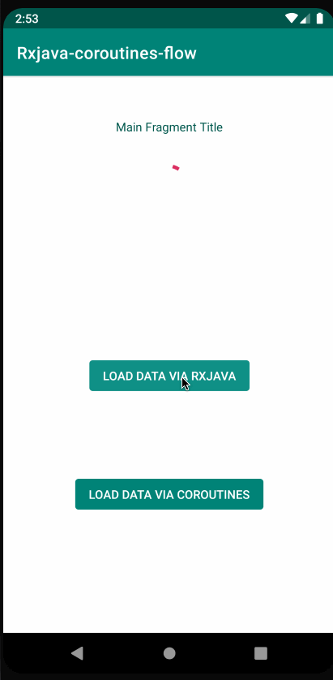

# Sample-Rxjava-vs-Coroutines/Flow
Basic sample to compare 2 different approaches for doing asynch business on Android. The app has a simple flow with data repository / room db and a viewModel connected via dagger (dependency injection) to the data model

The ViewModel calls the Repository to get the data. 

The data is: 
1 - fetched from retrofit / api
2 - stored into the DB (if previous records in the DB, then clear the DB first)
3 - returned do that it can be consumed by the viewModel

There are 2 repositories / api / dao:
- 1 supporting RxJava 
- 1 supporting Flow / coroutines

